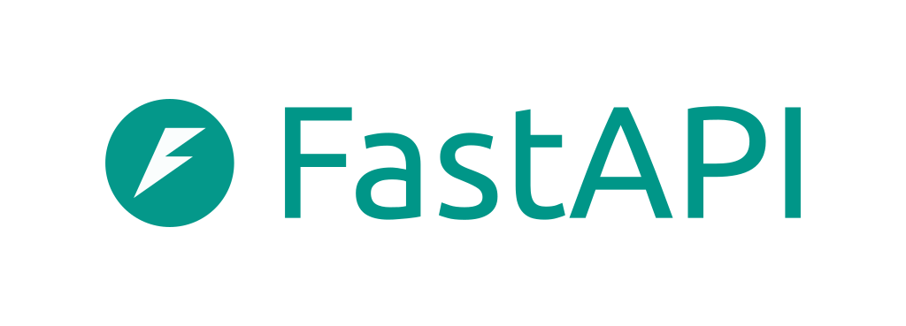
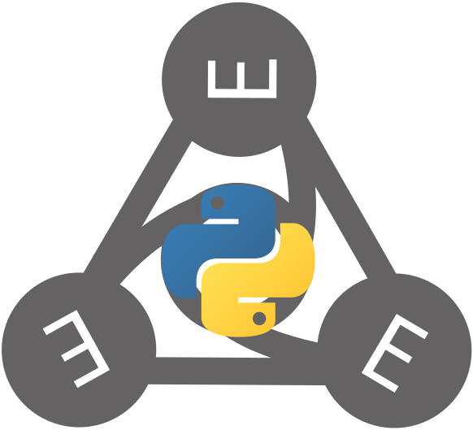

# BeAcross


 

BeAcross is an Across initiative platform providing you a variety of modules from different European **across border universities**.


## About Across
Across conducts an initiative led by Technische Universität Chemnitz known as the **Across Alliance**. This alliance consists of ten European universities that collectively form the European cross border University [Across](https://www.across-alliance.eu/) . 


## Across Aims
The goal is to facilitate successful cross-border exchange and collaboration within different regions in Europe. The initiative seeks to deepen cooperation among European universities situated across borders. The focus of this cooperation will be on crucial cross-border issues such as development and economic challenges, comparative law and public administration, education, natural resource management, tourism, migrations transportation, culture, and the preservation of cross-border cultural heritage.

## Visual
Across website sample


## Built With

[](https://www.python.org/)
[](https://fastapi.tiangolo.com/)
[](https://www.mongodb.com/)
[](https://scikit-learn.org/stable/)
[](https://owlready2.readthedocs.io/en/latest/)
[](https://react.dev/)
[](https://www.typescriptlang.org/)
[](https://getbootstrap.com/)
## Getting Started
To start Across web application, you have to start 2 services - Backend and Across. You have to set up your environment beforehand. Please follow these steps.
1. Setup your development environment for backend web services according to the [Backend README](/_backend/README.md)
2. Setup your development environment for Across website according to the [Across README](/across-app/README.md)
3. Start backend web services
4. Start Across website
5. Enjoy our website at [Across](localhost:3000/)

## Usage
There are 4 user roles in a BeAcross platform including
- Guest
- Student
- University Administrator
- System Administrator

### Logging into Across website
Here is initiative placeholder users that you can use in our application
#### Guest
As a Guest, you no need to log in to Across website

#### Student
As a Student, you can use the following email and password

* Email 

        across.student@s2023.tu-chemnitz.de

* Password
        
        FM2lf!L2


#### University Administrator
As a University Administrator, you can use the following email and password

* Email
    
        across.uni.admin@tu-chemnitz.de

* Password

        rwA!3BmT

#### System Administrator
As a System Administrator, you can use the following email and password

* Email
    
        across.sys.admin@tu-chemnitz.de

* Password

        rRi.Pz9c

## Roadmap
- [x] Add a searching feature by 
  - [x] basic terms
  - [x] advanced conditions
  - [x] course of studies
- [x] Add an automatically determination engine calculating suggested similar modules from module name, description, and credits.
  - [x] when imported new modules
  - [x] when updated existing modules
  - [x] when deleted existing modules
- [x] Add a comparing modules feature to compare modules side by side
- [x] Add a sharing button to share modules on social media
- [ ] Add a feeback feature sharing from alumnis to upcoming students by commenting on modules 
  - [x] sharing from student
  - [ ] sharing from only alumnis who took an exam
- [x] Add a favoriting feature that allows to pin modules into a particular semester in a personal plan
- [ ] Add a recommending feature 
  - [x] voted by student
  - [ ] voted by only alumnis who took an exam
- [ ] Add an importing modules feature by university admins
  - [x] using XML file
  - [ ] using JSON file
  - [ ] support more than 1 file at a time
- [ ] Add a account management feature
  - [x] student accounts managed by university admins
  - [ ] university admins accounts managed by system admins 
- [ ] Provide seamless login from university portal to Across using Single Sign-On (SSO) by university student/staff account
- [ ] Synchronize student personal data from university's portal
- [ ] Retrieve examination data from university's portal


## Contributing

If you have any suggestion that would make our website looks better or more convenience, please fork the repo and create a merge requeste. You can also simply open an issue with the tag "enhancement". Don't forget to give the project a star! Thank you again!

1. Fork the Project
2. Create your Feature Branch 
    ```
    git checkout -b feature/YourFeature
    ```
3. Commit your Changes 
    ```
    git commit -m 'Add some YourFeature'
    ```
4. Push to the Branch
    ```
    git push origin feature/YourFeature
    ```
5. Open a Pull Request


## Authors and acknowledgment
Show your appreciation to those who have contributed to the project.

## License
This project is under Technische Universität Chemnitz contributed by Victory Pie Solutions.

## Project Contributor & Support
This project is contributed by **Victory Pie Solutions**


A Slice of Trust, Innovation, and Comfort in Every Morning, Unlocking Your Industry's Full Potential 

Visit us at [Victory Pie Solutions](https://www.victorypiesolutions.com/) or [email](Victorypiesolutions@outlook.com)

## Project status
If you have run out of energy or time for your project, put a note at the top of the README saying that development has slowed down or stopped completely. Someone may choose to fork your project or volunteer to step in as a maintainer or owner, allowing your project to keep going. You can also make an explicit request for maintainers.